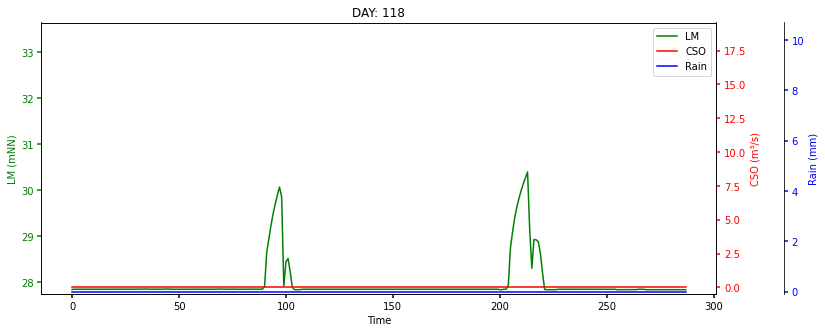
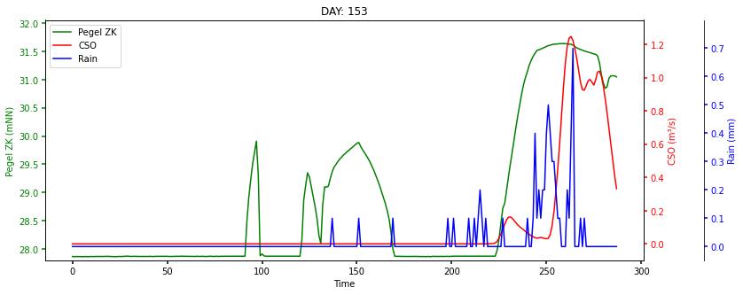
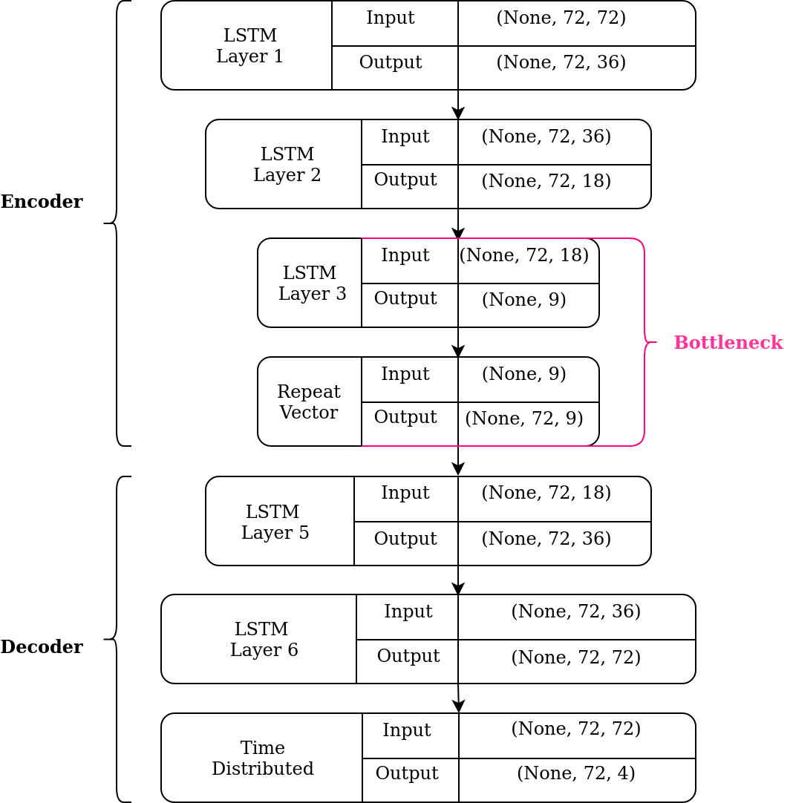
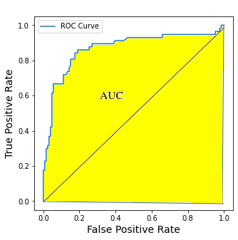
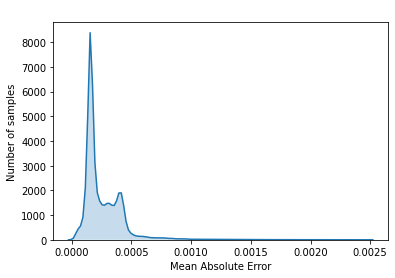

# CSO-Anomaly-Detection

## Table of Contents
1. [Introduction](#introduction)
2. [CSO Event vs. Non CSO Event](#CSOEventvsNonCSOEvent)
3. [Architecture](#archi)
4. [Performance](#performance)

## Introduction
Combined Sewer Overflow (CSO) events are a major reason for water pollution in open water bodies. Each time the sewer system is loaded with more storm- and wastewater than the connected sewer treatment plant can handle, the overload of storm- and wastewater is pumped into adjacent water bodies \cite{bwb}. Therefore it is necessary to detect possible incoming CSO events, in order to prevent an overload of the sewage system and be able to initiate counter measures before pumping additional wastewater into nature.  
This project aims to create an anoamly detection framework for preventing the emission of polluted water into adjacent ecosystems. Suitable data from weather stations are flow rate (FR) and level measurement (LM), as well as the amount of waste water in the canalization during the same time. Fluctuations of waste water and precipitation are highly dependent on daily cycles, as well as the seasons. The importance of this temporal aspect will be caputred by a Long short-term memory (LSTM) network, wich is able to take shorter, aswell as longer time periods into account. The trained model will then be used to predict CSO events from unseen weather forecasts.  
## CSO Event vs. Non CSO Event
A typical day without CSO events. The level measurement of the groundwater is higher in the morning and evening due to citiziens showering, cooking etc. However this spikes are to be expected and do not lead to CSO events. 

Heavy rain fall lets the level measurment rise, which leads to a CSO event around noon. This leads to wasterwater being pumped into nearby rivers in order to relieve the sewers - and the level measurement sinks again.

## Architecture

## Performance

The ROC curve gives the ratio between FPR and TPR. The depicted curve is way above the diagonal line which indicates a very good diagnostic ability. This is further strengthened by the AUC, which reaches a value of 0.91. Therefore this is indicating that the chosen model has an excellent measure of separability and it is up to the given task of detection the anomalies of the data set. The prediction error on the other hand shows the comparison between the original data set and the predicted data. The depicted density distribution displays a peak around an error of  5$\cdot 10^{-3}$ and most of the data has a smaller prediction error, or more precisely 85.3\%.  

